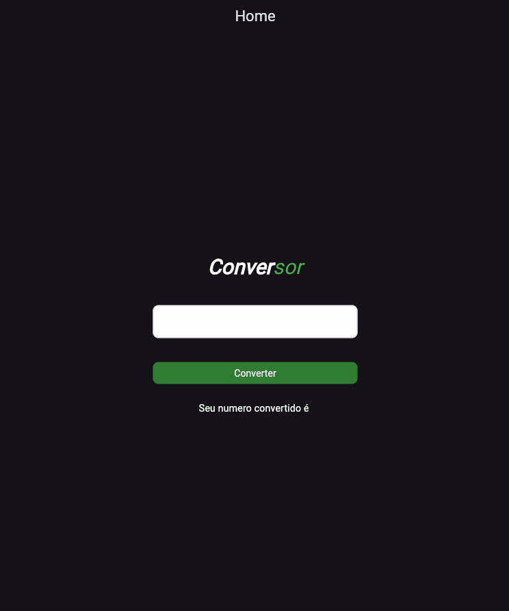

# Atividade para entrevista de emprego

Conversor de numero decimal para romano, e de romano para decimal.

obs: não foi usado nenhum pacote ou lib no projeto.

## Images




### Ferramentas que você vai precisar.

[Git](https://git-scm.com)
[Flutter](https://docs.flutter.dev/get-started/install)
[VSCode](https://code.visualstudio.com/)

#### Abra seu vscode e cole esses codigos.

```bash
# clonando o projeto para o seu pc:
$ git git@github.com:Av3z/buscacep.git

# entrando na pasta do projeto:
$ cd buscacep

# para inciar o projeto:
$ flutter run


